# Chapter 1: Thinking Like the JVM

Difficulty: Yellow Intermediate

Estimated Reading Time: 90 minutes

Prerequisites:

- Java basics.
- Object-oriented programming.
- Ability to compile and run a simple Java program.
- Basic awareness of threads.

## Before You Start

What you already know:

- Java classes and objects.
- Methods and local variables.
- Basic object references.
- Basic command-line Java execution.

What you will learn:

- Why the JVM exists.
- Why objects live on the heap.
- Why local variables live in stack frames.
- Why threads need private stacks and PC registers.
- Why bytecode may be interpreted first and optimized later.
- Why visibility, atomicity, and synchronization are separate ideas.

After this chapter, you should be able to explain:

- Why `count++` is unsafe across threads.
- Why `volatile` does not solve atomicity.
- Why `synchronized` locks objects.
- Why a Java service may behave differently immediately after restart.
- Why JVM internals matter in Kafka, edge gateways, and telemetry systems.

## Learning Objectives

By the end of this chapter, you should be able to:

- Explain how Java source code becomes running instructions on a CPU.
- Distinguish the roles of JDK, JRE, and JVM.
- Describe JVM startup from `java` command to `main` method execution.
- Explain class loading, linking, and initialization at a high level.
- Identify where objects, references, class metadata, stacks, and bytecode live.
- Reason about object reachability and garbage collection eligibility.
- Explain why each thread has its own stack and program counter.
- Describe bytecode execution through interpreter and JIT compilation.
- Explain the first mental model for visibility, race conditions, and synchronization.
- Answer interview questions using reasoning instead of memorized definitions.

## Why This Matters

Java engineers often use the JVM every day without thinking about it directly. That is fine until production asks a hard question:

- Why did memory grow even though traffic was stable?
- Why did one thread never see another thread's update?
- Why did CPU spike after deployment?
- Why did a shutdown flag work in testing but fail under load?
- Why did a synchronized block protect an object even after another reference pointed to it?

The JVM is not trivia. It is the execution environment for systems built with Spring Boot, Kafka clients, Flink, Cassandra, build tools, test runners, and many industrial edge services. A senior engineer can write Java. A principal engineer can reason about what the Java runtime is doing when the system is slow, stuck, inconsistent, or expensive.

## Mental Model

The JVM is a managed execution engine between Java bytecode and the operating system.

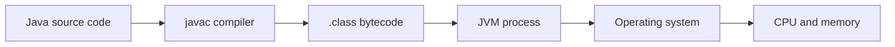

This picture is simple, but it contains the main idea:

- Java source is written by humans.
- Bytecode is the portable instruction format.
- The JVM loads, verifies, interprets, compiles, manages memory, schedules execution, and cooperates with the operating system.
- The CPU ultimately runs native machine instructions.

## How To Read This Chapter

Do not read this chapter as a list of JVM definitions.

Read it as a sequence of engineering problems:

- If Java source is portable, who makes it run on different machines?
- If an object outlives a method call, where can it live?
- If two threads execute the same method, how does each thread know where it is?
- If one thread writes a value, why might another thread not see it?
- If two references point to the same object, who owns the lock?

The pattern is always:

```text
problem -> JVM design choice -> engineering consequence
```

That is what it means to think like the JVM.

## Running Example: TelemetryGateway

To keep the chapter connected, we will use one running example: a Java-based telemetry gateway.

The gateway receives industrial telemetry, processes it in worker threads, publishes events to Kafka, and writes time-series data to storage.

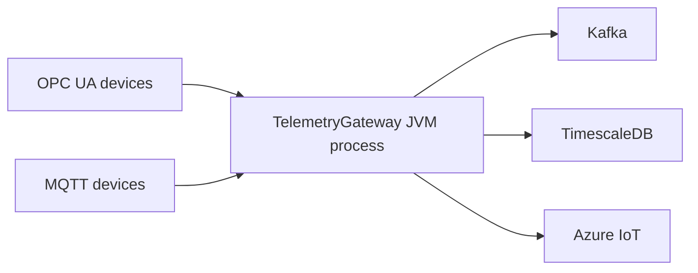

Inside the JVM, the same system contains objects, threads, bytecode execution, synchronization, and visibility concerns.

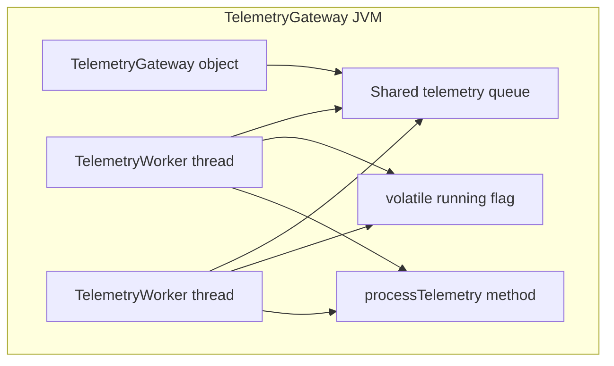

We will keep returning to this mental model:

- Heap: `TelemetryGateway`, queue, telemetry events.
- Stack: local variables inside `processTelemetry()`.
- Threads: `TelemetryWorker` instances executing concurrently.
- Visibility: `running` shutdown flag.
- Synchronization: shared queue or lock-protected state.
- JIT: hot `processTelemetry()` path.

## Part 1: The Java Platform

### Why Java?

Java was designed around a powerful tradeoff: write code once, then run it on any platform with a compatible JVM.

This does not mean Java ignores the operating system. A Java process still uses OS threads, files, sockets, memory pages, CPU cores, and native libraries. The promise is that Java source compiles to portable bytecode, and the JVM handles the platform-specific execution details.

### Mentor Conversation: Why Have a JVM?

Mentor:

If Java source code should run on Windows, Linux, and macOS, should `javac` produce one machine-code binary for every CPU and operating system?

Student:

That would make portability difficult.

Mentor:

Good. So what does Java produce instead?

Student:

Bytecode.

Mentor:

And who understands that bytecode on each platform?

Student:

The JVM for that platform.

### Write Once, Run Anywhere

The phrase "Write Once, Run Anywhere" depends on bytecode.

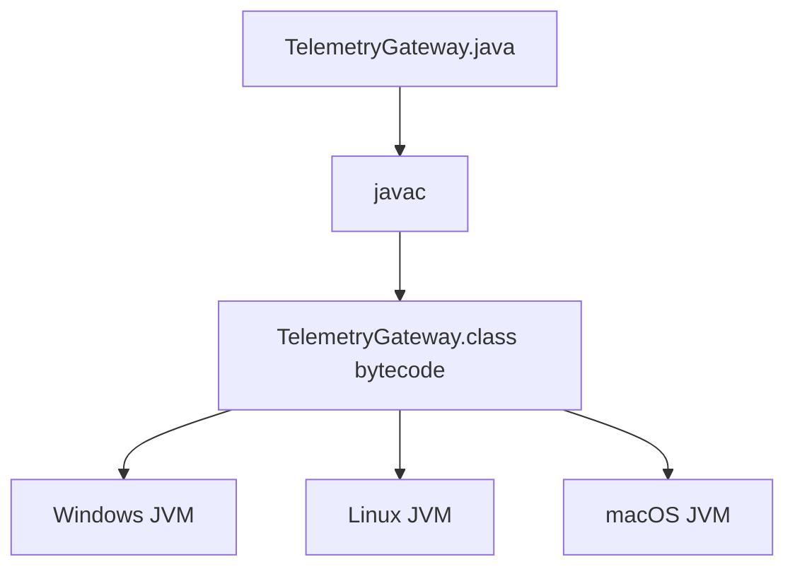

The same `.class` file can be executed by different JVM implementations for different operating systems and CPU architectures.

### JDK, JRE, JVM

| Term | Meaning | What it contains |
| --- | --- | --- |
| JDK | Java Development Kit | Compiler, tools, runtime, JVM |
| JRE | Java Runtime Environment | Runtime libraries and JVM |
| JVM | Java Virtual Machine | Execution engine, memory management, class loading, runtime services |

For modern Java distributions, the JRE is often bundled as part of the JDK rather than distributed separately. The distinction still matters conceptually:

- Use the JDK to develop and compile Java programs.
- Use the JVM to execute Java bytecode.

## Part 2: JVM Startup

When you run a Java program, the operating system starts a native process.

```bash
javac HelloJvm.java
java HelloJvm
```

At a high level:

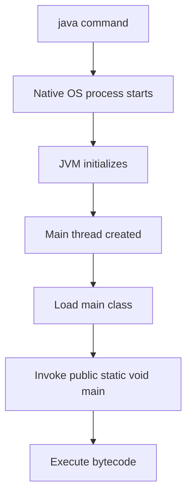

The `java` launcher is not the whole JVM by itself. It starts the JVM runtime and passes the selected main class, JVM options, classpath or module path, and program arguments.

## Part 3: Class Loading

The JVM does not load every class in your application at startup. Classes are commonly loaded lazily, when first needed.

The standard class loader hierarchy is:

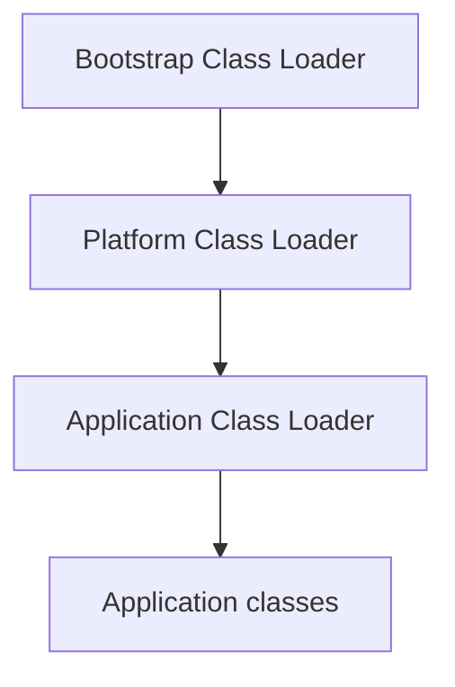

### Class Loader Roles

- Bootstrap Class Loader: Loads core Java classes such as `java.lang.String`.
- Platform Class Loader: Loads platform classes from the Java runtime.
- Application Class Loader: Loads application classes from the classpath or module path.

### Loading, Linking, Initialization

Class preparation has three broad phases:

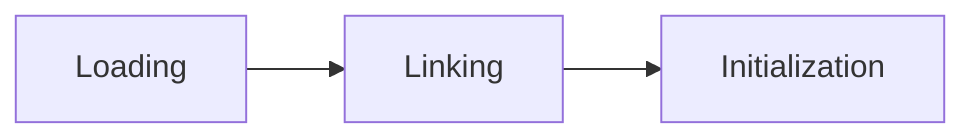

Loading finds class bytecode and creates the JVM's internal class representation.

Linking verifies bytecode safety, prepares static fields, and resolves symbolic references when needed.

Initialization runs class initialization logic, including static field initializers and static blocks.

## Part 4: Runtime Memory

The JVM uses several runtime memory areas. The most important beginner mistake is to treat "memory" as one bucket. It is not.

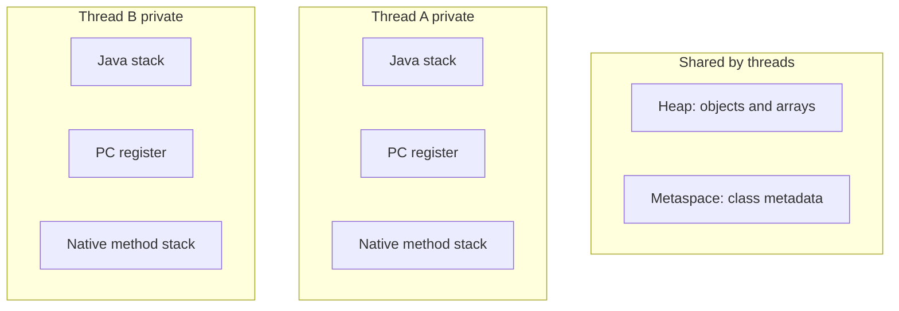

### Heap

Start with the problem:

```java
TelemetryGateway gateway = new TelemetryGateway();
```

Where should the JVM keep the `TelemetryGateway` object?

Inside the method call?

That fails because the object may need to outlive the method call.

Inside a CPU register?

That fails because objects are larger and longer-lived than a register value.

Inside one thread's private stack?

That fails because another thread may need to access the same object.

The JVM needs a shared runtime memory area for objects. That shared area is the heap.

The heap stores objects and arrays.

When code says:

```java
TelemetryGateway gateway = new TelemetryGateway();
```

the `TelemetryGateway` object is created on the heap.

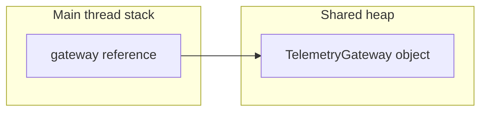

### Mentor Conversation: Heap

Mentor:

Where is the `TelemetryGateway` object?

Student:

Heap.

Mentor:

Why not the stack?

Student:

Because the object may need to outlive the method call and may be shared.

Mentor:

Excellent. The heap exists because object lifetime and sharing are bigger than one method frame.

### Stack

Each thread has its own Java stack. A stack contains stack frames. A stack frame is created for each active method call.

Local variables live in stack frames. If a local variable is a reference, the reference value is in the stack frame, while the object it points to is on the heap.

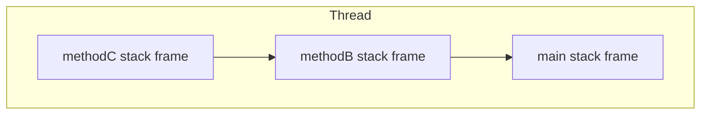

### Mentor Conversation: Stack

Mentor:

If two threads call the same method, do they share local variables?

Student:

No. Each thread has its own stack and its own stack frames.

Mentor:

So where does sharing usually happen?

Student:

Through heap objects or static state.

### Metaspace

Metaspace stores class metadata: information about loaded classes, methods, fields, runtime constant pools, and related structures.

The class definition for `TelemetryGateway` is not stored inside each `TelemetryGateway` object. The object has information that lets the JVM know its class, while the class metadata is maintained separately by the JVM.

### History Note: PermGen to Metaspace

Before Java 8, HotSpot used Permanent Generation, commonly called PermGen, for class metadata. Java 8 removed PermGen and introduced Metaspace, which uses native memory by default.

The practical lesson is simple: class metadata is not the same thing as ordinary heap object data. When debugging memory, do not assume every memory problem is only a heap problem.

### Advanced Note: Object Header and Mark Word

Every Java object has runtime metadata associated with it. In HotSpot discussions, you will often hear about the object header and Mark Word.

For now, remember only this:

- The object has identity.
- The object can be used for locking.
- The object carries runtime metadata used by the JVM.

Object layout, Mark Word details, biased locking history, and lock states deserve a later deep dive.

### Deep Dive Preview: How HotSpot Actually Represents Objects

This chapter intentionally avoids exact object layout details because they depend on JVM implementation and runtime options.

In a later chapter, we will study:

- Object headers.
- Mark Word.
- Klass pointer.
- Compressed ordinary object pointers.
- Alignment and padding.
- Lock states.
- How object layout affects memory cost.

For now, the correct mental model is enough: a Java object is more than its fields. The JVM also needs runtime metadata to manage identity, locking, type information, and garbage collection.

### PC Register

Each thread has a program counter register. It tracks where that thread is executing in the current method.

If two threads run the same method, they do not share the same execution position. Each thread has its own PC register and its own stack.

### Mentor Conversation: PC Register

Mentor:

Two threads are running the same `processTelemetry()` method. Are they necessarily executing the same bytecode instruction at the same moment?

Student:

No.

Mentor:

What lets each thread track its own position?

Student:

Its own PC register.

### Native Method Stack

The native method stack supports execution of native code invoked through mechanisms such as JNI.

## Part 5: Objects and References

Consider:

```java
TelemetryGateway gateway = new TelemetryGateway();
```

This single line involves three different ideas:

| Thing | Where it lives | Explanation |
| --- | --- | --- |
| `gateway` | Stack frame if local variable | A reference variable holding a reference value |
| `new TelemetryGateway()` object | Heap | The actual object instance |
| `TelemetryGateway` class metadata | Metaspace | Runtime representation of the loaded class |

Now consider:

```java
TelemetryGateway gateway1 = new TelemetryGateway();
TelemetryGateway gateway2 = gateway1;
```

There is still one object.

There are two reference variables.

Both reference variables point to the same heap object.

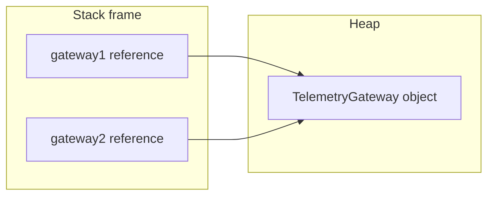

This distinction matters for synchronization, garbage collection, and interview questions.

### How Interviewers Think: Object vs Reference

An interviewer asking this is rarely testing syntax:

```java
TelemetryGateway gateway1 = new TelemetryGateway();
TelemetryGateway gateway2 = gateway1;
```

They are testing whether you can separate:

- Variable.
- Reference value.
- Heap object.
- Object identity.
- Reachability.
- Monitor ownership.

A strong answer says:

```text
There is one TelemetryGateway object on the heap. There are two reference variables. Both references point to the same object, so there is one object identity and one associated monitor.
```

## Part 6: Object Life Cycle

An object is eligible for garbage collection when it is no longer reachable from any live root.

Common GC roots include:

- Local variables in active stack frames.
- Static fields of loaded classes.
- Active threads.
- JNI references.

Example:

```java
TelemetryGateway gateway = new TelemetryGateway();
gateway = null;
```

After `gateway = null`, the object may become eligible for garbage collection if no other reachable reference points to it.

Now compare:

```java
TelemetryGateway gateway1 = new TelemetryGateway();
TelemetryGateway gateway2 = gateway1;
gateway1 = null;
```

The object is not eligible for garbage collection because `gateway2` still reaches it.

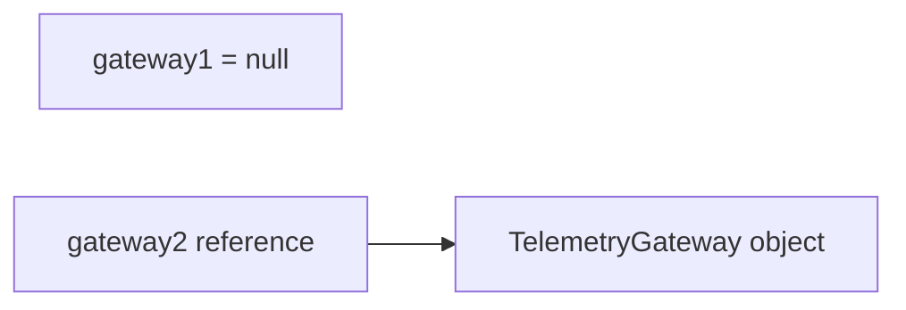

Eligibility does not mean immediate collection. It means the garbage collector is allowed to reclaim the object in a future GC cycle.

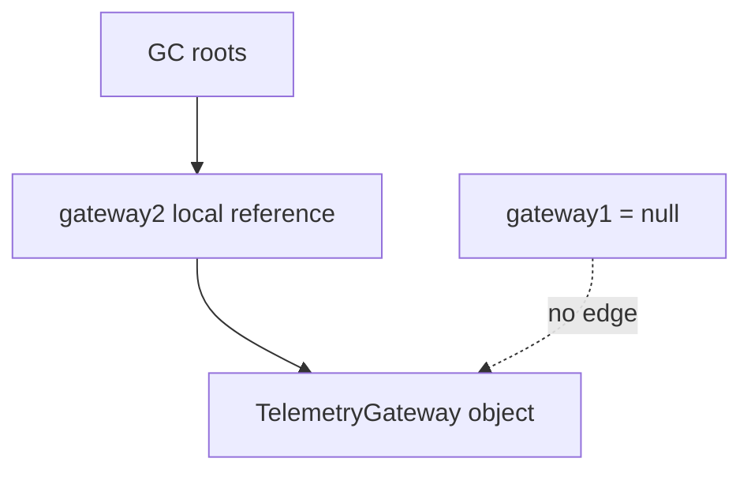

### Mentor Conversation: GC Eligibility

Mentor:

After `gateway1 = null`, does the object disappear?

Student:

No.

Mentor:

What question does the garbage collector ask?

Student:

Can this object still be reached from live roots?

Mentor:

Exactly. Garbage collection is about reachability, not emotion around variable names.

## Part 7: Execution Engine

The JVM execution engine runs bytecode.

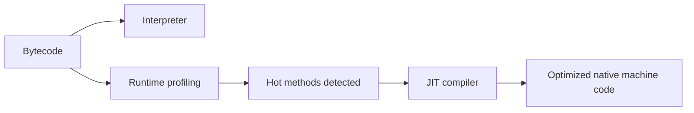

### Interpreter

The interpreter executes bytecode instruction by instruction. This is simple and starts quickly.

### HotSpot and Hot Methods

The HotSpot JVM observes runtime behavior. Frequently executed methods or loops are considered hot.

### JIT Compiler

The Just-In-Time compiler converts hot bytecode into optimized native machine code. This improves long-running performance but adds complexity:

- Warmup matters.
- Benchmarks can lie if they ignore JIT behavior.
- Optimizations may depend on runtime assumptions.

### History Note: Interpreter to HotSpot to Tiered Compilation

Early Java performance depended heavily on interpretation. HotSpot changed the story by observing runtime behavior and optimizing hot paths.

Modern HotSpot commonly uses tiered compilation, where code can move through different levels of profiling and optimization. GraalVM adds another major branch of JVM innovation, including an advanced compiler and native-image capabilities.

The important engineering idea is that Java performance is dynamic. The code running at second one may not be optimized the same way as the code running at minute ten.

### Deep Dive Preview: JIT Is Not Just "Compilation"

Later, JIT deserves its own chapter because it includes:

- Profiling.
- Inlining.
- Escape analysis.
- Deoptimization.
- Tiered compilation.
- Compiler threads.
- Benchmarking traps.

For this chapter, remember the first principle: the JVM learns from runtime behavior and may optimize hot code while the application is running.

### Mentor Conversation: JIT

Mentor:

Why might a Kafka consumer be slower immediately after restart?

Student:

The JVM may still be warming up.

Mentor:

What does warming up mean?

Student:

The JVM is interpreting, profiling, and compiling hot methods.

## Part 8: Threads

Threads share some JVM memory areas and own others.

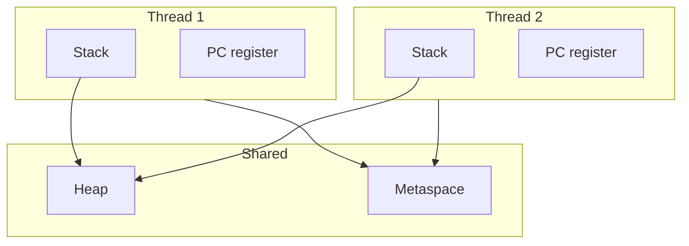

Each thread gets:

- Its own Java stack.
- Its own PC register.
- Its own execution path.

Threads share:

- Heap objects.
- Class metadata.
- Static fields.

This is the foundation of Java concurrency. Bugs happen when multiple threads access shared state without correct coordination.

### Mentor Conversation: Threads

Mentor:

What does each thread own?

Student:

Its stack and PC register.

Mentor:

What do threads share?

Student:

Heap objects and class metadata.

Mentor:

So where do concurrency bugs usually begin?

Student:

Shared mutable state on the heap.

## Part 9: First Look at the Java Memory Model

The Java Memory Model defines the rules for how threads see memory effects from other threads.

The beginner mental model is:

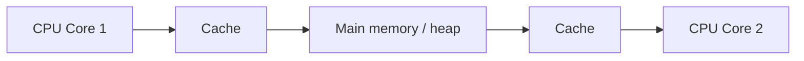

This diagram is simplified, but useful. Modern CPUs and compilers optimize aggressively. A write by one thread does not automatically become visible to another thread at the time you expect unless the program establishes the right memory guarantees.

### Race Condition

This code is not atomic:

```java
count++;
```

It is closer to:

```text
read count
modify value
write count
```

If two threads interleave these steps, updates can be lost.

### Visibility

A visibility bug happens when one thread writes a value but another thread does not observe it promptly or reliably.

Example:

```java
class Worker {
    private boolean running = true;

    void stop() {
        running = false;
    }

    void run() {
        while (running) {
            // do work
        }
    }
}
```

Without a visibility guarantee, another thread calling `stop()` may not be enough for the worker loop to observe the update.

### Volatile

`volatile` helps with visibility and ordering for reads and writes of that variable.

It does not make compound operations atomic.

```java
private volatile boolean running = true;
```

This is appropriate for a simple shutdown flag. It is not enough for `count++`.

### Mentor Conversation: Visibility

Mentor:

Thread A sets `running = false`. Why might Thread B keep running?

Student:

Thread B may not see the updated value.

Mentor:

What kind of bug is that?

Student:

A visibility bug.

Mentor:

What can be enough for a simple shutdown flag?

Student:

`volatile`.

Mentor:

And why is `volatile` not enough for `count++`?

Student:

Because increment is read, modify, write. It needs atomicity, not only visibility.

### How Interviewers Think: Volatile

A weak answer says:

```text
volatile means visibility.
```

A stronger answer says:

```text
volatile gives visibility and ordering guarantees for reads and writes of that variable. It can be appropriate for a simple shutdown flag, but it does not make compound operations atomic. For count++, I need atomic types, locking, or another concurrency design.
```

### Ordering and Happens-Before

The JVM, JIT compiler, and CPU may reorder instructions when the observable single-threaded result remains valid. Concurrency makes this harder: another thread may observe effects in surprising ways unless the code establishes a happens-before relationship.

Happens-before is the formal rule that says one action's effects must be visible to another action.

Examples of mechanisms that can establish happens-before relationships include:

- Starting a thread.
- Joining a thread.
- Lock release followed by lock acquire on the same monitor.
- Volatile write followed by volatile read of the same variable.

## Part 10: Synchronization

Every Java object can be used as a monitor.

This is one of the most important object model facts in the chapter:

```java
synchronized (gateway) {
    // protected by gateway object's monitor
}
```

The lock belongs to the object, not the reference variable.

```java
TelemetryGateway gateway1 = new TelemetryGateway();
TelemetryGateway gateway2 = gateway1;

synchronized (gateway1) {
    synchronized (gateway2) {
        // same object, same monitor
    }
}
```

There is one object, so there is one object header and one monitor relationship.

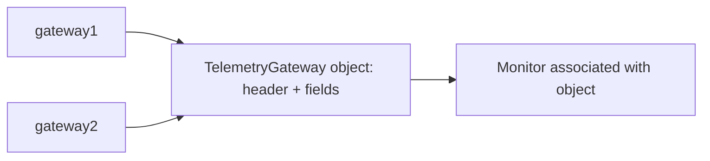

Changing a reference does not move the monitor:

```java
TelemetryGateway gateway1 = new TelemetryGateway();
TelemetryGateway gateway2 = gateway1;
gateway1 = new TelemetryGateway();
```

Now there are two objects. The original object still has its own identity and monitor. The new object has a different identity and monitor.

### Mentor Conversation: Monitor

Mentor:

Who owns the monitor?

Student:

The object.

Mentor:

Does the reference variable own the monitor?

Student:

No.

Mentor:

If `gateway1` and `gateway2` point to the same object, how many monitors matter for that object?

Student:

One.

### How Interviewers Think: Synchronization

The interviewer may ask:

```java
TelemetryGateway gateway1 = new TelemetryGateway();
TelemetryGateway gateway2 = gateway1;
```

How many objects, Mark Words, and monitors?

A strong answer:

```text
There is one TelemetryGateway object. Conceptually, there is one object header for that object and one monitor association for synchronization. There are two reference variables, but references do not own monitors.
```

## Runnable Example

Create [examples/HelloJvm.java](examples/HelloJvm.java):

```java
public class HelloJvm {
    static class TelemetryGateway {
        private final String gatewayId;

        TelemetryGateway(String gatewayId) {
            this.gatewayId = gatewayId;
        }
    }

    public static void main(String[] args) {
        TelemetryGateway gateway1 = new TelemetryGateway("edge-01");
        TelemetryGateway gateway2 = gateway1;

        System.out.println(gateway1 == gateway2);

        gateway1 = null;

        System.out.println(gateway2 != null);
    }
}
```

Run it:

```bash
javac HelloJvm.java
java HelloJvm
```

Expected output:

```text
true
true
```

What this demonstrates:

- `gateway1` and `gateway2` initially point to the same object.
- Setting `gateway1` to `null` does not destroy the object.
- The object remains reachable through `gateway2`.

## Mentor Conversation

Mentor:

Where is the `TelemetryGateway` object?

Student:

Heap.

Mentor:

Where is the reference variable `gateway1` if it is local to `main`?

Student:

Inside the stack frame of the main thread.

Mentor:

Good. Where is the class definition for `TelemetryGateway`?

Student:

In JVM-managed class metadata, commonly discussed as Metaspace.

Mentor:

Now tell me why the object is not collected after `gateway1 = null`.

Student:

Because another reachable reference, `gateway2`, still points to the same heap object.

Mentor:

Exactly. The garbage collector cares about reachability, not whether the original variable name still points to the object.

## What Is Really Happening

The JVM is continuously coordinating several responsibilities:

- Loading classes when they are needed.
- Verifying bytecode before executing it.
- Creating objects on the heap.
- Creating stack frames for method calls.
- Tracking each thread's execution position.
- Interpreting bytecode.
- Compiling hot code into native machine code.
- Managing object reachability and garbage collection.
- Enforcing memory model rules around visibility, ordering, and synchronization.

The value of this chapter is not that you now know every JVM detail. The value is that you can ask better questions when Java code behaves unexpectedly.

## When Not To Use This Mental Model

This chapter uses simplified diagrams. They are useful for learning, but they are not full JVM implementation diagrams.

Do not use this chapter alone to:

- Tune garbage collectors in production.
- Explain exact HotSpot object layout under every JVM flag.
- Predict JIT assembly output.
- Prove Java Memory Model behavior formally.
- Replace profiling, heap dumps, thread dumps, or production telemetry.

The model is a foundation. Future chapters will deepen it.

## Production Case Studies

### Case Study 1: Edge Gateway Worker Shutdown

An edge gateway service consumes telemetry from machines and forwards normalized events to Kafka. During shutdown, the service sets a `running` flag to `false` and expects worker threads to stop.

Symptom:

- Shutdown sometimes hangs.
- CPU remains active.
- Logs show the shutdown request was received.

Initial hypothesis:

- The worker loop is stuck in I/O.

Investigation:

- Thread dumps show a worker repeatedly looping.
- The shutdown method wrote `running = false`.
- The worker loop reads `running`, but the field is a plain boolean.

Root cause:

- The code has a visibility bug. One thread writes the flag, but the worker thread has no reliable visibility guarantee.

Fix:

- Use `volatile` for the simple shutdown flag, or use a higher-level concurrency primitive depending on the design.

Engineering lesson:

- A program can be logically correct in a single-threaded explanation and still fail under real concurrent execution.

### Case Study 2: Kafka Consumer Warmup

A Kafka consumer service is restarted during a deployment. For the first few minutes, throughput is lower and latency is higher than usual. After some time, performance stabilizes.

Symptom:

- Consumer lag grows after restart.
- CPU is active, but throughput is temporarily lower.
- The same code performs better after several minutes.

Initial hypothesis:

- Kafka broker or network latency increased.

Investigation:

- Broker metrics look normal.
- Network metrics look normal.
- The service has just restarted, and hot paths are still warming up.

Root cause:

- The JVM is interpreting and profiling code before the JIT compiler fully optimizes hot methods.

Fix or mitigation:

- Avoid drawing benchmark conclusions from cold-start behavior alone.
- Include warmup in performance tests.
- Consider startup behavior when designing autoscaling and rolling deployments.

Engineering lesson:

- Java performance is not static. Runtime optimization changes behavior over the life of the process.

### Case Study 3: Telemetry Pipeline Object Churn

A telemetry ingestion service handles millions of sensor readings per minute. Each reading is transformed into multiple short-lived objects before being written to storage.

Symptom:

- Latency spikes appear under peak load.
- GC logs show frequent collections.
- Heap usage rises and falls rapidly.

Initial hypothesis:

- The database is slow.

Investigation:

- Database latency is stable.
- Allocation rate is high.
- Many temporary objects are created during parsing and enrichment.

Root cause:

- High object churn creates GC pressure.

Fix or mitigation:

- Reduce unnecessary intermediate allocations.
- Batch carefully.
- Reuse buffers only where it is safe and clear.
- Measure allocation rate, not just heap size.

Engineering lesson:

- The heap is not just where objects live. It is also where allocation behavior becomes an operational cost.

## Common Misconceptions

- Misconception: The heap stores all variables.
  Reality: Objects live on the heap. Local variables live in stack frames. A local variable may hold a reference to a heap object.

- Misconception: `volatile` makes code thread-safe.
  Reality: `volatile` helps with visibility and ordering. It does not make compound actions like `count++` atomic.

- Misconception: `synchronized` locks a reference.
  Reality: `synchronized` locks the object referred to by the reference expression.

- Misconception: If a reference is set to `null`, the object is immediately deleted.
  Reality: The object becomes eligible for garbage collection only if no live roots can reach it.

- Misconception: Every Java method is compiled to native code before it runs.
  Reality: The JVM can interpret bytecode first and compile hot paths later.

## Production Implications

This chapter affects real systems in direct ways:

- Performance: JIT warmup affects latency and benchmark results.
- Reliability: Visibility bugs can break shutdown, failover, and background workers.
- Scalability: Shared heap objects require correct synchronization strategy.
- Debugging: Thread dumps, heap dumps, and JVM flags make more sense when the memory model is clear.
- Operations: JVM startup, class loading, and memory behavior affect container sizing and cold start time.

## Failure Modes

- A local reference is assumed to own an object, causing confusion around aliasing.
- A shutdown flag is not volatile or otherwise synchronized.
- A shared counter uses `count++` across threads and loses updates.
- A memory issue is investigated only as "heap problem" while class metadata, stacks, or native memory are ignored.
- A benchmark ignores JVM warmup and draws the wrong conclusion.
- Synchronization uses the wrong lock object, allowing shared state to be modified concurrently.

## Debugging Checklist

- [ ] Is the problem startup, memory, CPU, locking, visibility, or GC?
- [ ] Which objects are shared between threads?
- [ ] Which variables are local to a thread?
- [ ] Is the code relying on visibility without `volatile`, locks, atomics, thread start, join, or another happens-before relationship?
- [ ] Are multiple references pointing to the same object?
- [ ] Does the issue appear only after warmup or only during cold start?
- [ ] Would a thread dump, heap dump, GC log, or profiler clarify the runtime state?

## Debugging Toolkit

Use the symptom to choose the first diagnostic tool.

| Problem | First tool | What you are looking for |
| --- | --- | --- |
| High CPU | Thread dump | Threads repeatedly running the same code path, busy loops, blocked pools |
| Memory growth | Heap dump | Object types retaining memory and reference paths from GC roots |
| Frequent GC | GC logs | Collection frequency, pause time, allocation pressure, heap occupancy |
| Latency spikes | Java Flight Recorder | Allocation hot spots, lock contention, CPU samples, GC pauses |
| Startup slowdown | Startup logs and profiling | Class loading, initialization, framework startup, cold code paths |
| Warmup behavior | JIT logs or JFR | Hot methods, compilation activity, deoptimization, changing throughput |
| Deadlock or blocking | Thread dump | Blocked threads, lock owners, monitor contention |
| Visibility suspicion | Code review plus thread dump | Shared mutable state without volatile, locks, atomics, or clear happens-before |

The tool does not replace reasoning. It gives evidence for the runtime state you are trying to understand.

## What We Intentionally Simplified

This chapter teaches the mental model first. Some statements are true enough for reasoning, but later chapters will refine them.

### "Objects live on the heap"

This is the right beginner model. However, HotSpot may optimize some allocations using techniques such as escape analysis and scalar replacement. In some cases, the JVM can avoid allocating an object as a normal heap object if it proves the object does not escape.

Do not use that advanced detail to erase the basic model. Use it as a later refinement:

```text
source-level object
-> JVM analysis
-> possible optimization
-> observable behavior must still match Java semantics
```

### "The JVM interprets, then JIT compiles"

This is a useful learning model. Real JVM execution can include tiered compilation, profiling, compiler threads, deoptimization, native calls, intrinsics, and implementation-specific behavior.

### "The heap is shared"

The heap is shared by threads, but thread-local allocation buffers and CPU caches make the real performance story more nuanced. The semantic model remains: heap objects can be shared, and shared mutable state requires correct coordination.

### "The monitor belongs to the object"

This is the correct Java-level reasoning model. The exact monitor implementation can change across JVM versions and optimization states. Later lock chapters should explain object headers, Mark Word, lightweight locking, inflated monitors, and related HotSpot details.

## Interview Questions

1. What happens when you run `java HelloJvm`?
2. What is the difference between JDK, JRE, and JVM?
3. Where is a Java object stored?
4. Where is a local reference variable stored?
5. Where is class metadata stored?
6. If `TelemetryGateway gateway2 = gateway1`, how many objects exist?
7. If `gateway1 = null`, when is the object eligible for garbage collection?
8. Why does each thread need its own stack?
9. What does the PC register track?
10. What is a hot method?
11. Why is `count++` not atomic?
12. What problem does `volatile` solve?
13. What problem does `volatile` not solve?
14. Does `synchronized` lock a reference or an object?
15. Why should a principal engineer care about JVM internals?

## Exercises

### Beginner

1. Draw the memory layout for `TelemetryGateway gateway = new TelemetryGateway();`.
2. Draw the memory layout for `TelemetryGateway gateway1 = new TelemetryGateway(); TelemetryGateway gateway2 = gateway1;`.
3. Explain why `gateway1 = null` does not necessarily make the object eligible for GC.
4. Label heap, stack, Metaspace, object, reference, and class metadata in one diagram.

### Intermediate

1. Write a class with a `volatile boolean running` shutdown flag.
2. Explain why `volatile int count; count++;` is still unsafe across threads.
3. Create two references to the same object and synchronize on both. Explain why they use the same monitor.
4. Run a small Java program repeatedly and explain why JVM warmup can matter for performance measurements.

### Advanced

1. Design a JVM service that handles telemetry from 1000 MQTT devices. Identify how many worker threads you would start, what state is shared, and what synchronization or concurrency primitives are needed.
2. Review a Kafka consumer loop and identify where visibility, atomicity, object allocation, and shutdown behavior matter.
3. Design a debugging plan for a Java service with high CPU, rising latency, and frequent GC.
4. Explain how you would teach object identity, monitor ownership, and reference aliasing to a junior engineer.

## Think Like the JVM

When you see:

```java
TelemetryGateway gateway = new TelemetryGateway();
```

do not stop at "Java object."

Think:

```text
local variable e
-> stack frame
-> reference value
-> heap object
-> object header
-> class metadata
-> possible monitor
-> reachability from GC roots
```

When you see:

```java
volatile boolean running;
```

think:

```text
thread A writes
-> memory visibility
-> thread B reads
-> ordering guarantee
-> shutdown behavior
```

When you see:

```java
synchronized (gateway) {
}
```

think:

```text
reference expression
-> heap object
-> monitor associated with object
-> happens-before through lock release and acquire
```

This is the signature skill: translate Java syntax into runtime consequences.

## Summary

The JVM is the managed runtime that executes Java bytecode. It loads classes, manages runtime memory, executes bytecode, compiles hot paths, coordinates threads, and enforces memory rules.

The most important first principles are:

- Objects live on the heap.
- Local reference variables live in stack frames.
- Class metadata lives in JVM-managed metadata memory.
- Threads have private stacks and PC registers.
- Threads share heap objects and class metadata.
- Garbage collection depends on reachability.
- `volatile` is about visibility and ordering, not full thread safety.
- `synchronized` locks objects, not reference variables.

This is the foundation for thinking like the JVM.

## Chapter Roadmap

You now have the first mental model for:

- Java platform execution.
- JVM startup.
- Class loading.
- Runtime memory.
- Object references.
- Garbage collection reachability.
- Interpreter and JIT execution.
- Thread-private and thread-shared memory.
- Visibility and atomicity.
- Object monitors.

Next chapters should go deeper into:

- Class loader internals.
- Object layout and Mark Word.
- Garbage collection algorithms.
- JIT compilation and profiling.
- Java Memory Model rules.
- Synchronization and lock implementation.

## Further Reading

- [The Java Virtual Machine Specification, Java SE 21 Edition](https://docs.oracle.com/javase/specs/jvms/se21/html/index.html): Authoritative specification for JVM structure, class files, runtime data areas, bytecode, and execution rules.
- [The Java Language Specification, Java SE 21 Edition](https://docs.oracle.com/javase/specs/jls/se21/html/index.html): Authoritative specification for Java language semantics.
- [OpenJDK HotSpot Group](https://openjdk.org/groups/hotspot/): OpenJDK entry point for HotSpot JVM work.
- *Effective Java* by Joshua Bloch: Practical Java design guidance.
- *Java Concurrency in Practice* by Brian Goetz et al.: Foundational book for Java concurrency, visibility, atomicity, and safe publication.

## Chapter Links

- Previous: None yet.
- Next: Future chapter on class loading.
- Related:
  - [Interview Questions](interview.md)
  - [Common Mistakes](common-mistakes.md)
  - [Principal Engineer Notes](principal-notes.md)
  - [Glossary](glossary.md)
