# JVM Diagrams

These Mermaid diagrams support Chapter 1.

## TelemetryGateway Architecture

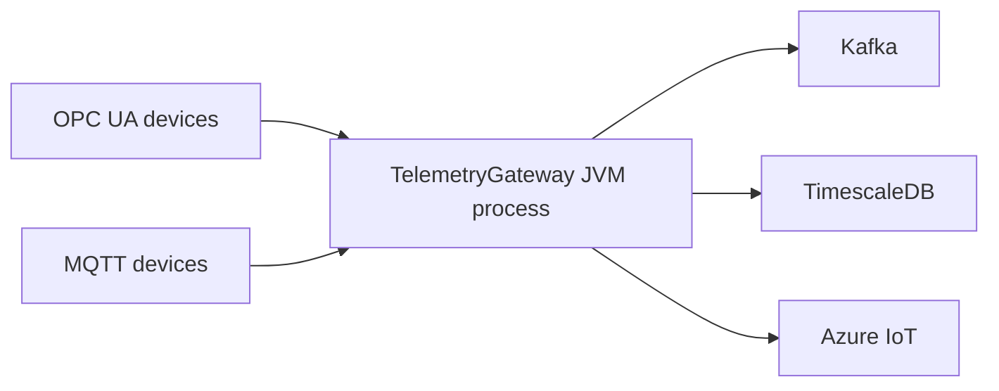

## TelemetryGateway JVM Internals

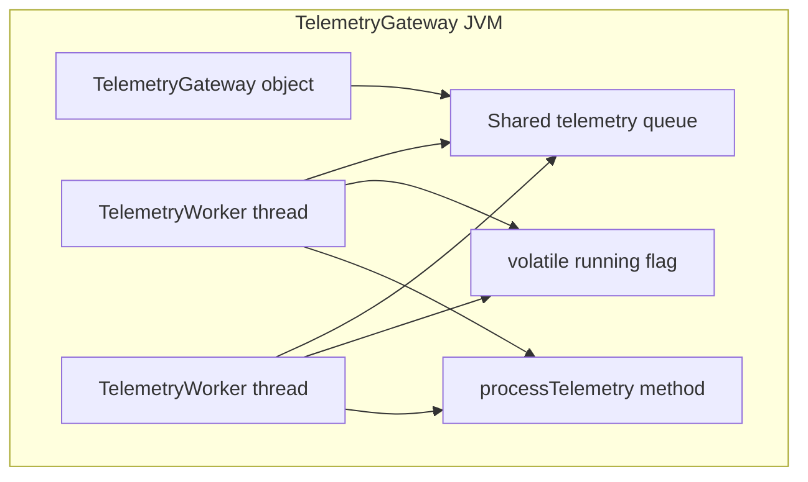

## Java Execution

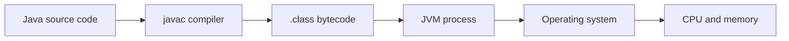

## JVM Startup

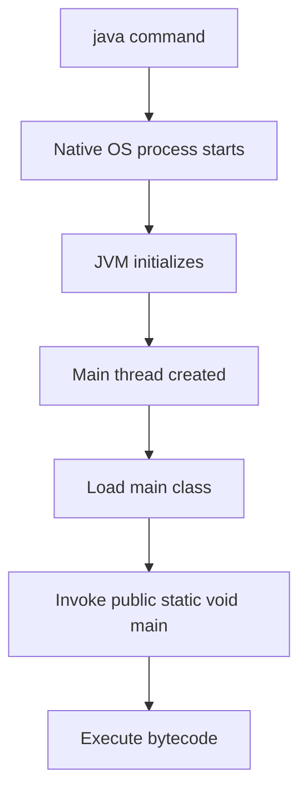

## Runtime Memory

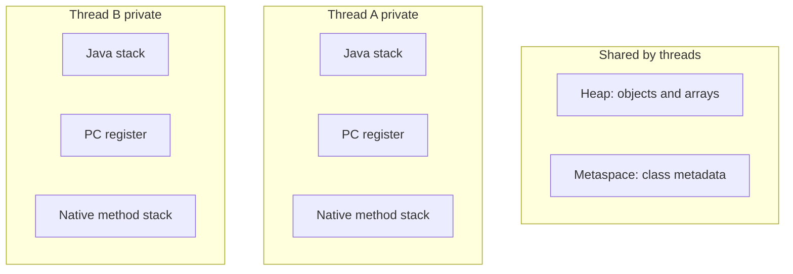

## Heap Object

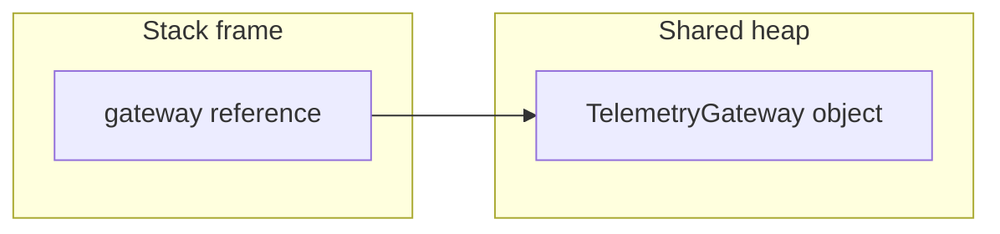

## Stack Frames

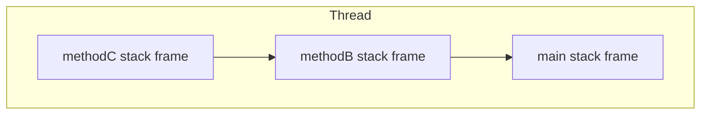

## Object References

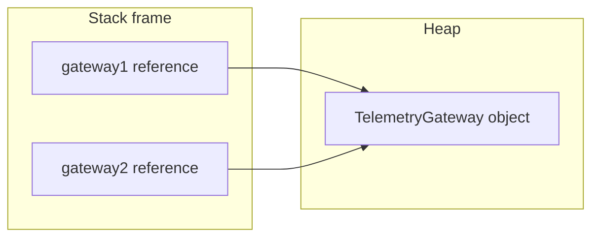

## Garbage Collection Reachability

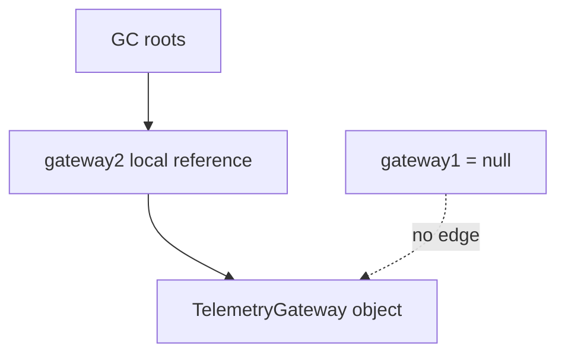

## Monitor Ownership

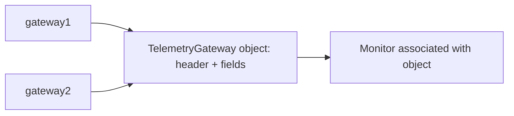

## JIT Execution

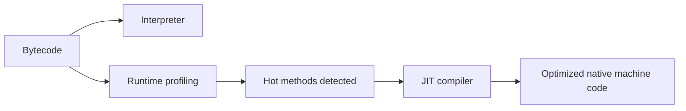

## CPU Cache Visibility

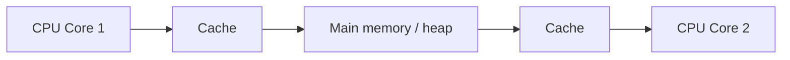
