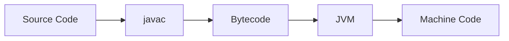

# Style Guide

This guide keeps the handbook consistent, readable, and useful as a long-term engineering resource.

## Voice and Tone

Write like a senior engineer teaching another engineer:

- Clear.
- Precise.
- Practical.
- Calm.
- Honest about tradeoffs.

Avoid hype, filler, and exaggerated claims.

## Markdown Standards

- Use one `#` heading per file.
- Use `##` and `###` headings to create a readable structure.
- Keep paragraphs short and purposeful.
- Use bullets for lists of related ideas.
- Use numbered lists for ordered workflows.
- Use tables only when they improve comparison.
- Use fenced code blocks with language identifiers.

## Explanation Standards

A strong explanation should answer:

- What is it?
- Why does it exist?
- How does it work?
- Where does it fail?
- How does it show up in production?
- How would you explain it in an interview?

## Diagrams

Use Mermaid for architecture, flow, sequence, and state diagrams.

Example:



Diagram guidance:

- Prefer clarity over visual complexity.
- Label arrows when the relationship matters.
- Keep diagrams close to the explanation they support.
- Do not add diagrams that repeat text without improving understanding.

## Code Examples

Code examples should be:

- Runnable.
- Small enough to understand.
- Focused on one idea.
- Named clearly.
- Accompanied by expected behavior or output when useful.

Use commands when they help the reader run the example:

```bash
javac Example.java
java Example
```

## Interview Sections

Interview questions should test understanding, not memorization.

Prefer questions like:

- "What happens if this assumption fails?"
- "How would this behave under load?"
- "What tradeoff is this design making?"
- "How would you debug this in production?"

## Exercises

Exercises should encourage active learning:

- Modify an example.
- Predict output before running it.
- Draw a diagram.
- Explain a tradeoff.
- Debug a failure.
- Extend a small implementation.

## Review Checklist

Before committing a chapter, verify:

- The chapter follows `CHAPTER_TEMPLATE.md`.
- The core explanation is technically correct.
- Examples are runnable or clearly marked as illustrative.
- Diagrams render as Mermaid.
- The chapter includes misconceptions, production implications, interview questions, and exercises where relevant.
- The writing is concise and professional.
